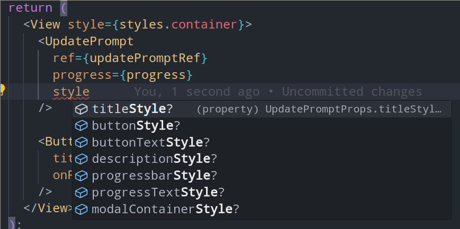

# rn-apk-update

`rn-apk-update` is a React Native library designed to provide in-app update functionality for Android applications distributed outside the Google Play Store. This library allows you to check for updates, download APK files, and install them directly within your app, making it a perfect solution for apps distributed via APK files.

## Demo
Watch the demo of `rn-apk-update`:

<video width="100%" controls>
  <source src="./assets/demo.mp4" type="video/mp4">
</video>

## Features
- Check for updates from a remote server.
- Download APK files with a progress bar.
- Prompt users to update their app with a customizable modal.
- Install APKs directly from within the app.

## Installation

To install the library, run the following command:

```sh
yarn add rn-apk-update
```
or
```sh
npm install rn-apk-update
```

## Peer Dependencies
```sh
yarn add react-native-blob-util@^0.19.11 react-native-device-info@^13.0.0 @react-native-community/progress-bar-android@^1.0.5
```
or
```sh
npm install react-native-blob-util@^0.19.11 react-native-device-info@^13.0.0 @react-native-community/progress-bar-android@^1.0.5
```

## Android Setup

In order to enable APK downloads and installation in your app, you need to add the following permissions to your AndroidManifest.xml:

```xml
<uses-permission android:name="android.permission.REQUEST_INSTALL_PACKAGES" />
<uses-permission android:name="android.permission.READ_EXTERNAL_STORAGE" android:maxSdkVersion="32" /> 
<uses-permission android:name="android.permission.WRITE_EXTERNAL_STORAGE" android:maxSdkVersion="29" />
```

These permissions are required to:

Allow the app to request permission to install APKs from unknown sources.
Handle APK files stored on external storage (depending on your app’s target SDK version).

## Usage
Below is an example of how to use rn-apk-update in a React Native app:

```js
import { useState, useRef } from 'react';
import { StyleSheet, View, Button } from 'react-native';
import ApkUpdate, { type UpdatePromptMethods } from 'rn-apk-update';

const App = () => {
  const [downloadProgress, setDownloadProgress] = useState<number>(0);
  const { checkForUpdate, UpdatePrompt, downloadAndInstallApk } = ApkUpdate();
  const updatePromptRef = useRef<UpdatePromptMethods>(null);

  const handleCheckForUpdates = async () => {
    const isUpdateAvailable = await checkForUpdate('https://example.com/version.json');

    if (isUpdateAvailable) {
      updatePromptRef?.current?.prompt(
        'Update Available', 'A new version of the app is available.\nDo you want to update?', [
        {
          title: 'Update',
          onPress: () => downloadAndInstallApk('https://example.com/app.apk', {
            onProgress(progress: number) {
              setDownloadProgress(progress);
            },
            onProgressComplete() {
              updatePromptRef?.current?.close();
            },
          }),
        },
        { title: 'Cancel', onPress: () => updatePromptRef?.current?.close() },
      ]);
    }
  };

  return (
    <View style={styles.container}>
      <UpdatePrompt ref={updatePromptRef} progress={downloadProgress} />

      <Button
        title="Check for Updates"
        onPress={handleCheckForUpdates}
      />
    </View>
  );
};

const styles = StyleSheet.create({
  container: {
    flex: 1,
    alignItems: 'center',
    justifyContent: 'center',
  },
});

export default App;
```

# Customization
Custom Styling For Update Prompt




## Contributing

See the [contributing guide](CONTRIBUTING.md) to learn how to contribute to the repository and the development workflow.

## License

MIT

---
